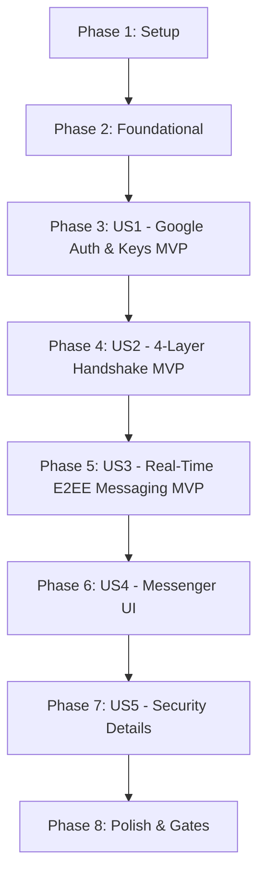

# Tasks: 1-1 End-to-End Encrypted Chat with 4-Layer Handshake Verification

**Feature Branch**: `001-e2ee-chat-messaging`  
**Date**: 2026-08-28  
**Spec Reference**: [`specs/001-e2ee-chat-messaging/spec.md`](spec.md) | [`plan.md`](plan.md) | [`data-model.md`](data-model.md) | [`contracts/rest-api.yaml`](contracts/rest-api.yaml)

---

## Phase 1: Setup (Shared Infrastructure)

**Purpose**: Initialize project structure, build dependencies, and shared configuration.

- [X] T001 Initialize Maven backend structure and configure Spring Boot dependencies in `pom.xml`
- [X] T002 [P] Initialize React + TypeScript + Vite frontend project with Tailwind CSS in `frontend/package.json` and `frontend/vite.config.ts`
- [X] T003 [P] Configure Tailwind CSS styling tokens, theme colors, and glassmorphism utilities in `frontend/tailwind.config.js` and `frontend/src/index.css`
- [X] T004 [P] Configure environment application properties template and local override in `src/main/resources/application.properties` and `src/main/resources/application-local.properties.example`
- [X] T005 [P] Setup JaCoCo code coverage plugin with 80% overall and 90% domain threshold in `pom.xml`

---

## Phase 2: Foundational (Blocking Prerequisites)

**Purpose**: Core infrastructure that MUST be complete before ANY user story can be implemented.

- [X] T006 Implement machine-readable `ApiError` and Global Exception Handler with MDC Trace ID in `src/main/java/org/example/chat/presentation/exception/GlobalExceptionHandler.java`
- [X] T007 [P] Configure Spring Security filter chain with Google OAuth2 Token Verifier and stateless JWT in `src/main/java/org/example/chat/infrastructure/security/SecurityConfig.java`
- [X] T008 [P] Implement JWT Token Provider and Authentication Filter in `src/main/java/org/example/chat/infrastructure/security/JwtTokenProvider.java` and `src/main/java/org/example/chat/infrastructure/security/JwtAuthenticationFilter.java`
- [X] T009 [P] Configure Spring Data MongoDB connection and indexes in `src/main/java/org/example/chat/infrastructure/persistence/mongodb/MongoConfig.java`
- [X] T010 [P] Configure Spring WebSocket STOMP message broker and SockJS endpoint in `src/main/java/org/example/chat/infrastructure/websocket/WebSocketConfig.java`
- [X] T011 [P] Implement client-side Web Crypto Engine (SubtleCrypto ECDH P-256, HKDF, AES-256-GCM, SHA-256) in `frontend/src/crypto/webCryptoEngine.ts`
- [X] T012 [P] Implement client-side IndexedDB manager for local private keys and offline message cache in `frontend/src/db/indexedDbManager.ts`
- [X] T013 [P] Setup REST API client and WebSocket STOMP client in `frontend/src/services/apiClient.ts` and `frontend/src/services/stompClient.ts`

**Checkpoint**: Core infrastructure ready — User Story implementation can now proceed.

---

## Phase 3: User Story 1 - Google Authentication & Cryptographic Key Initialization (Priority: P1) 🎯 MVP

**Goal**: Enable users to log in with Google OAuth2, retrieve user profiles, generate local ECDH key pairs, and register public key bundles.

**Independent Test**: User signs in with Google, profile information displays on UI, and local ECDH keys are securely generated in IndexedDB and public key bundle is registered on backend.

### Tests for User Story 1
- [X] T014 [P] [US1] Unit test for Google Token Verifier and JWT issuance in `src/test/java/org/example/chat/unit/JwtTokenProviderTest.java`
- [X] T015 [P] [US1] Contract test for `/api/v1/auth/google` and `/api/v1/users/keys` in `src/test/java/org/example/chat/contract/AuthApiContractTest.java`
- [X] T016 [P] [US1] Cryptographic test vector verification for Web Crypto key generation in `frontend/src/crypto/__tests__/webCryptoEngine.test.ts`

### Implementation for User Story 1
- [X] T017 [P] [US1] Create `UserProfile` domain model and MongoDB entity in `src/main/java/org/example/chat/domain/model/UserProfile.java` and `src/main/java/org/example/chat/infrastructure/persistence/mongodb/document/UserDocument.java`
- [X] T018 [P] [US1] Create `UserPublicKeyBundle` model and MongoDB document in `src/main/java/org/example/chat/domain/model/UserPublicKeyBundle.java` and `src/main/java/org/example/chat/infrastructure/persistence/mongodb/document/UserPublicKeyDocument.java`
- [X] T019 [US1] Implement `UserService` and `UserRepository` in `src/main/java/org/example/chat/application/service/UserService.java` and `src/main/java/org/example/chat/infrastructure/persistence/mongodb/repository/UserRepositoryImpl.java`
- [X] T020 [US1] Implement `AuthController` and `UserKeyController` in `src/main/java/org/example/chat/presentation/controller/AuthController.java` and `src/main/java/org/example/chat/presentation/controller/UserKeyController.java`
- [X] T021 [US1] Implement React `useAuth` hook and Google Login button in `frontend/src/hooks/useAuth.ts` and `frontend/src/components/auth/GoogleLoginButton.tsx`

**Checkpoint**: User Story 1 fully functional and testable independently.

---

## Phase 4: User Story 2 - 4-Layer Asynchronous Handshake Verification (Priority: P1) 🎯 MVP

**Goal**: Enforce the mandatory 4-layer verification flow (Google account check, invitation consent, pre-key exchange, visual 6-digit safety code confirmation) for initiating 1-1 chats.

**Independent Test**: User A searches User B by exact Gmail, sends invitation while User B is offline; User B logs in, accepts, verifies matching 6-digit code, and unlocks the conversation.

### Tests for User Story 2
- [X] T022 [P] [US2] Unit test for 4-layer handshake state transitions in `src/test/java/org/example/chat/unit/HandshakeServiceTest.java`
- [X] T023 [P] [US2] Contract test for Handshake REST endpoints (`/api/v1/conversations`, `/handshake/accept`, `/handshake/confirm-safety-code`) in `src/test/java/org/example/chat/contract/HandshakeContractTest.java`
- [X] T024 [P] [US2] Test for 6-digit safety code calculation and match verification in `frontend/src/crypto/__tests__/safetyCode.test.ts`

### Implementation for User Story 2
- [X] T025 [P] [US2] Create `Conversation` and `HandshakeVerification` domain models and Mongo documents in `src/main/java/org/example/chat/domain/model/Conversation.java` and `src/main/java/org/example/chat/domain/model/HandshakeVerification.java`
- [X] T026 [US2] Implement `HandshakeService` and state machine orchestration in `src/main/java/org/example/chat/application/service/HandshakeService.java`
- [X] T027 [US2] Implement `ConversationController` with exact Gmail search and handshake actions in `src/main/java/org/example/chat/presentation/controller/ConversationController.java`
- [X] T028 [US2] Implement real-time Handshake notification push via STOMP `/user/queue/notifications` in `src/main/java/org/example/chat/presentation/websocket/HandshakeNotificationHandler.java`
- [X] T029 [US2] Implement frontend 4-Layer Handshake modal and 6-digit Safety Code Dialog in `frontend/src/components/handshake/HandshakeModal.tsx` and `frontend/src/components/handshake/SafetyCodeConfirmDialog.tsx`
- [X] T030 [US2] Implement frontend Exact Gmail Search Bar and contact discovery in `frontend/src/components/sidebar/ExactGmailSearchBar.tsx`

**Checkpoint**: User Stories 1 AND 2 functional; secure verified channels can be established.

---

## Phase 5: User Story 3 - Real-Time End-to-End Encrypted Messaging & Media (Priority: P1) 🎯 MVP

**Goal**: Enable real-time E2EE messaging (text, emoji, images ≤ 5MB) over WebSocket with Zero-Knowledge backend persistence, read receipts, and message recall (unsend).

**Independent Test**: Two verified users exchange real-time encrypted text and images, verify instant decryption on client, verify MongoDB stores only ciphertext, and verify unsend for everyone removes the bubble content.

### Tests for User Story 3
- [X] T031 [P] [US3] Unit & Zero-Knowledge invariant test (asserting no plaintext in MongoDB/logs) in `src/test/java/org/example/chat/integration/ZeroKnowledgeMessageTest.java`
- [X] T032 [P] [US3] STOMP WebSocket contract and message delivery test in `src/test/java/org/example/chat/contract/WebSocketMessageContractTest.java`
- [X] T033 [P] [US3] Unit test for client-side AES-256-GCM encryption/decryption of text and image files in `frontend/src/crypto/__tests__/messageEncryption.test.ts`

### Implementation for User Story 3
- [X] T034 [P] [US3] Create `EncryptedMessage` domain model and Mongo document in `src/main/java/org/example/chat/domain/model/EncryptedMessage.java` and `src/main/java/org/example/chat/infrastructure/persistence/mongodb/document/EncryptedMessageDocument.java`
- [X] T035 [US3] Implement `MessageService` with unverified channel blocking check in `src/main/java/org/example/chat/application/service/MessageService.java`
- [X] T036 [US3] Implement STOMP `ChatStompController` (`/app/chat.send`, `/app/chat.typing`, `/app/chat.read`, `/app/chat.unsend`) in `src/main/java/org/example/chat/presentation/websocket/ChatStompController.java`
- [X] T037 [US3] Implement `MediaController` for uploading encrypted image blobs in `src/main/java/org/example/chat/presentation/controller/MediaController.java`
- [X] T038 [US3] Implement React `useChat` hook managing real-time STOMP subscriptions and local decryption in `frontend/src/hooks/useChat.ts`
- [X] T039 [US3] Implement message bubble, rich input bar with image attachment button, and unsend menu in `frontend/src/components/chat/MessageBubble.tsx`, `frontend/src/components/chat/ChatInputBar.tsx`, and `frontend/src/components/chat/MessageActionsMenu.tsx`

**Checkpoint**: Core MVP (User Stories 1, 2, 3) complete with full E2EE communication!

---

## Phase 6: User Story 4 - Messenger-Inspired Modern User Interface (Priority: P2)

**Goal**: Deliver a polished Messenger-style UI with conversation sidebar, active badges, typing indicator animation, and responsive layout.

**Independent Test**: Test UI across desktop and mobile screen widths (360px - 2560px), test sidebar conversation sorting by recent activity, unread badges, and smooth full-screen chat transitions on mobile.

### Tests for User Story 4
- [X] T040 [P] [US4] Component interaction test for Messenger Sidebar and Conversation List in `frontend/src/components/sidebar/__tests__/ConversationList.test.tsx`
- [X] T041 [P] [US4] Component test for Typing Indicator animation and read receipt badges in `frontend/src/components/chat/__tests__/TypingIndicator.test.tsx`

### Implementation for User Story 4
- [X] T042 [P] [US4] Implement Messenger Sidebar with recent conversations, unread badges, and active status in `frontend/src/components/sidebar/ConversationSidebar.tsx` and `frontend/src/components/sidebar/ConversationItem.tsx`
- [X] T043 [P] [US4] Implement Chat Window Header with contact avatar, online indicator, and security badge in `frontend/src/components/chat/ChatHeader.tsx`
- [X] T044 [P] [US4] Implement Real-Time Typing Indicator component with spring dots animation in `frontend/src/components/chat/TypingIndicator.tsx`

**Checkpoint**: All 5 user stories complete with security transparency tools.

---

## Phase 7: User Story 5 - Conversation Security Details & Safety Number Verification (Priority: P3)

**Goal**: Provide users with a dedicated security drawer to inspect 4-layer verification status, review the 60-digit fingerprint / QR code, and manage blocking.

**Independent Test**: Open the Security Details panel in active chat, compare the 60-character fingerprint with peer session, verify safety number changed alerts, and test contact blocking.

### Tests for User Story 5
- [X] T046 [P] [US5] Component test for Security Details Drawer and QR code rendering in `frontend/src/crypto/__tests__/qrCode.test.ts`
- [X] T047 [P] [US5] Integration test for contact block and session termination in `src/test/java/org/example/chat/integration/ContactBlockIntegrationTest.java`

### Implementation for User Story 5
- [X] T048 [P] [US5] Implement `SecurityDetailsDrawer` displaying 4-layer audit history and 60-digit fingerprint in `frontend/src/components/security/SecurityDetailsDrawer.tsx`
- [X] T049 [P] [US5] Implement QR Code display component for out-of-band safety number comparison in `frontend/src/components/security/SafetyNumberQrCode.tsx`
- [X] T050 [US5] Implement safety number changed warning banner and re-verify action in `frontend/src/components/chat/SafetyNumberAlertBanner.tsx`
- [X] T051 [US5] Implement contact blocking API and frontend block button in `src/main/java/org/example/chat/presentation/controller/BlockController.java` and `frontend/src/components/security/BlockContactButton.tsx`

**Checkpoint**: All 5 user stories complete with security transparency tools.

---

## Phase 8: Polish & Cross-Cutting Concerns

**Purpose**: Quality gate validation, end-to-end testing, documentation, and performance tuning.

- [X] T052 [P] Execute and verify JaCoCo test coverage report meeting ≥ 80% overall and ≥ 90% domain logic requirement in `pom.xml`
- [X] T053 [P] Implement end-to-end test suite covering full Google Login, 4-Layer Handshake, and Encrypted Chat flow in `src/test/java/org/example/chat/integration/FullEndToEndChatIntegrationTest.java`
- [X] T054 [P] Verify Zero-Knowledge audit asserting zero plaintext in MongoDB queries and server log outputs
- [X] T055 Execute complete developer validation scenarios per `quickstart.md`
- [X] T056 [P] Update developer and deployment documentation in `README.md`

---

## Dependencies & Execution Order

### Parallel Opportunities

- **Phase 1 (Setup)**: `T002`, `T003`, `T004`, `T005` can run in parallel.
- **Phase 2 (Foundational)**: `T007`, `T008`, `T009`, `T010`, `T011`, `T012`, `T013` can run in parallel.
- **Phase 3 (US1)**: Tests `T014`, `T015`, `T016` can run in parallel before models `T017`, `T018`.
- **Phase 4 (US2)**: Tests `T022`, `T023`, `T024` can run in parallel before implementation.
- **Phase 5 (US3)**: Tests `T031`, `T032`, `T033` can run in parallel before `T034`-`T039`.
- **Phase 6 & 7 (US4, US5)**: UI components `T042`, `T043`, `T044`, `T048`, `T049` can be developed in parallel.

---

## Implementation Strategy

### 1. MVP First (Phases 1-5: User Stories 1, 2, 3)
1. Complete Setup & Foundational prerequisites.
2. Deliver Google OAuth + local Web Crypto key generation (US1).
3. Deliver 4-layer asynchronous handshake verification (US2).
4. Deliver real-time E2EE messaging for text and encrypted images (US3).
5. **Validate MVP**: Test secure messaging end-to-end with Zero-Knowledge verification.

### 2. Incremental Polish (Phases 6-8: User Stories 4, 5 & Quality Gates)
1. Layer on responsive Messenger aesthetics and animations (US4).
2. Add conversation security inspector and fingerprint QR comparison (US5).
3. Run JaCoCo coverage (≥ 80%) and Playwright E2E test suites (Phase 8).
