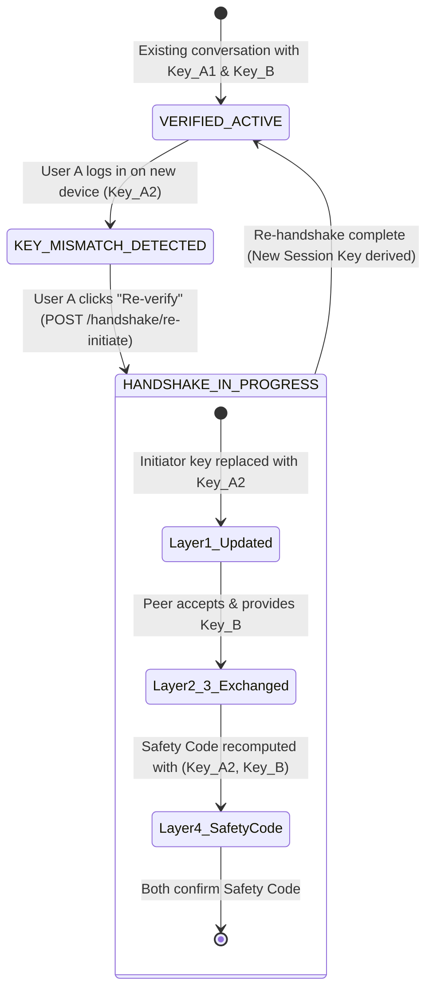
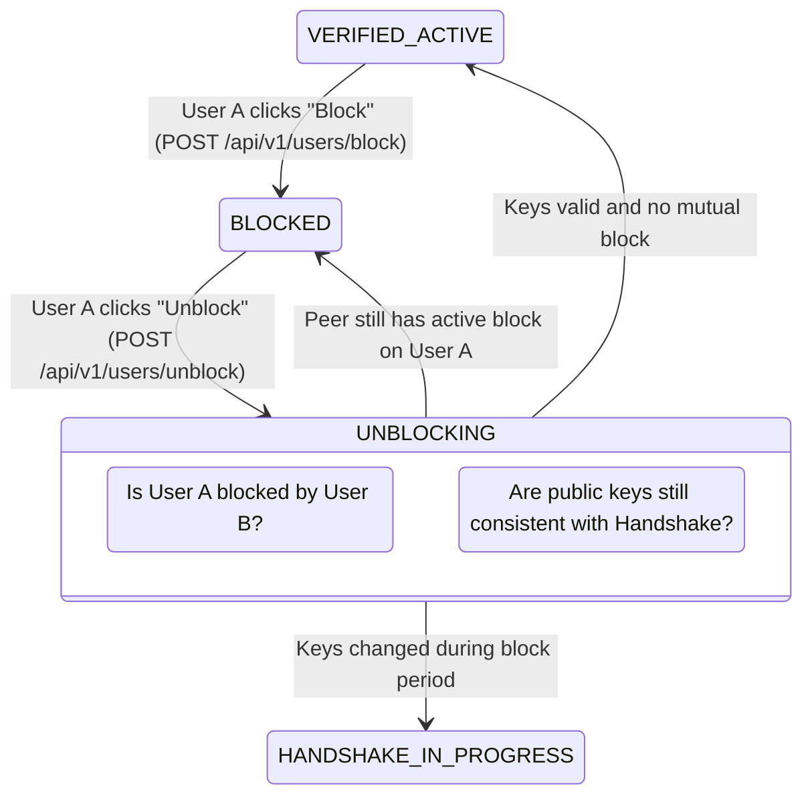

# Data Model & State Transitions: Re-Handshake & Unblock Contact

**Feature**: `002-rehandshake-and-unblock`
**Date**: 2026-08-30

## 1. Domain Entities & Database Documents

### 1.1. Conversation Entity & ConversationDocument
Collection: `conversations`

```json
{
  "_id": "66d1a2b3c4d5e6f7a8b9c0d1",
  "participantAId": "user_alice_123",
  "participantBId": "user_bob_456",
  "status": "VERIFIED_ACTIVE", // Enum: INITIATING, PENDING_ACCEPTANCE, HANDSHAKE_IN_PROGRESS, VERIFIED_ACTIVE, BLOCKED
  "blockedByUserId": null, // Optional: captures who initiated the block when status == BLOCKED
  "createdAt": "2026-08-30T10:00:00Z",
  "updatedAt": "2026-08-30T10:30:00Z"
}
```

### 1.2. HandshakeVerification Entity & HandshakeVerificationDocument
Collection: `handshake_verifications`

```json
{
  "_id": "66d1a2b3c4d5e6f7a8b9c0d2",
  "conversationId": "66d1a2b3c4d5e6f7a8b9c0d1",
  "initiatorId": "user_alice_123",
  "recipientId": "user_bob_456",
  "initiatorPublicKey": "MFkwEwYHKoZIzj0CAQYIKoZIzj0DAQcDQgAE...", // SPKI Base64 ECDH P-256
  "recipientPublicKey": "MFkwEwYHKoZIzj0CAQYIKoZIzj0DAQcDQgAE...", // SPKI Base64 ECDH P-256
  "layer1Status": "VERIFIED",
  "layer1VerifiedAt": "2026-08-30T10:00:00Z",
  "layer2Status": "ACCEPTED",
  "layer2AcceptedAt": "2026-08-30T10:01:00Z",
  "layer3Status": "EXCHANGED",
  "layer3ExchangedAt": "2026-08-30T10:01:00Z",
  "layer4Status": "CONFIRMED",
  "layer4ConfirmedAt": "2026-08-30T10:02:00Z",
  "safetyCode": "583921", // Deterministic 6-digit visual code
  "fullFingerprintHex": "a1b2c3d4e5f6...", // SHA-256 64-character hex string
  "version": 2, // Incremented on each Re-Handshake
  "completedAt": "2026-08-30T10:02:00Z"
}
```

### 1.3. UserProfile Entity & UserProfileDocument
Collection: `users`

```json
{
  "_id": "user_alice_123",
  "googleSubjectId": "google_sub_112233",
  "email": "alice@gmail.com",
  "displayName": "Alice Smith",
  "avatarUrl": "https://lh3.googleusercontent.com/...",
  "blockedUserIds": ["user_charlie_789"], // Set of blocked user IDs
  "createdAt": "2026-08-30T09:00:00Z",
  "lastSeenAt": "2026-08-30T10:30:00Z",
  "isOnline": true
}
```

---

## 2. State Transition Diagrams

### 2.1. Re-Handshake State Transition



### 2.2. Block & Unblock State Transition


