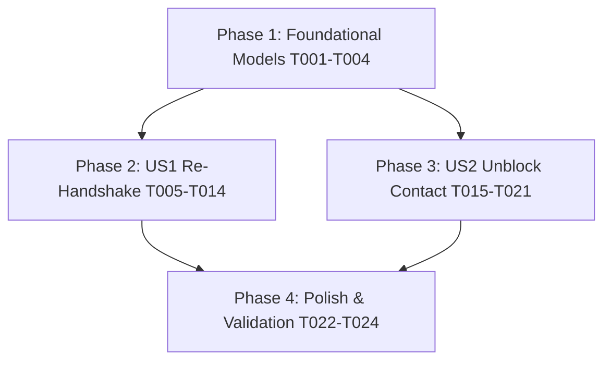

# Tasks: Re-Handshake & Unblock Contact

**Input**: Design documents from `specs/002-rehandshake-and-unblock/`
**Prerequisites**: [plan.md](./plan.md), [spec.md](./spec.md), [research.md](./research.md), [data-model.md](./data-model.md), [contracts/](./contracts/)

## Format: `- [ ] [TaskID] [P?] [Story?] Description with file path`
- **[P]**: Can run in parallel (different files, no dependencies)
- **[Story]**: User story tag (e.g. `[US1]`, `[US2]`)

---

## Phase 1: Setup & Foundational Prerequisites

**Purpose**: Core setup and model extensions required across stories

- [X] T001 [P] Add `version` field to `HandshakeVerificationDocument` in `src/main/java/org/example/chat/infrastructure/persistence/mongodb/document/HandshakeVerificationDocument.java`
- [X] T002 [P] Add `version` field to `HandshakeVerification` domain model in `src/main/java/org/example/chat/domain/model/HandshakeVerification.java`
- [X] T003 [P] Add `blockedUserIds` set to `UserProfileDocument` in `src/main/java/org/example/chat/infrastructure/persistence/mongodb/document/UserProfileDocument.java`
- [X] T004 [P] Add `blockedUserIds` to `UserProfile` domain model in `src/main/java/org/example/chat/domain/model/UserProfile.java`

---

## Phase 2: User Story 1 - Automatic Key Mismatch Detection & Re-Handshake (Priority: P1) 🎯 MVP

**Goal**: Enable client-side detection of changed identity keys, re-initiating 4-layer consensus with peer, broadcasting STOMP `KEY_CHANGED` events, and deriving a new synchronized E2EE session key.

**Independent Test**: Clear identity keys on User A's browser, open an existing verified conversation with User B, verify the "Security Key Changed" banner appears, click "Re-verify", complete 4-layer verification on both clients, and verify new messages can be encrypted and decrypted without error.

### Backend Implementation (US1)
- [X] T005 [P] [US1] Add `notifyKeyChanged` method in `src/main/java/org/example/chat/presentation/websocket/HandshakeNotificationHandler.java`
- [X] T006 [US1] Implement `reInitiateHandshake` in `src/main/java/org/example/chat/application/service/HandshakeService.java`
- [X] T007 [US1] Expose `POST /api/v1/conversations/{conversationId}/handshake/re-initiate` in `src/main/java/org/example/chat/presentation/controller/ConversationController.java`
- [X] T008 [P] [US1] Write unit and contract tests for `reInitiateHandshake` endpoint in `src/test/java/org/example/chat/presentation/controller/ConversationControllerTest.java`

### Frontend Implementation (US1)
- [X] T009 [P] [US1] Add `reInitiateHandshake` API method and DTO types in `frontend/src/services/apiClient.ts`
- [X] T010 [P] [US1] Add `KEY_CHANGED` event payload handling in `frontend/src/services/stompClient.ts`
- [X] T011 [US1] Implement key mismatch detection (`isKeyMismatched`) and re-handshake trigger in `frontend/src/hooks/useChat.ts`
- [X] T012 [P] [US1] Connect `SafetyNumberAlertBanner` with `onVerify` and dismiss actions in `frontend/src/components/chat/SafetyNumberAlertBanner.tsx`
- [X] T013 [US1] Integrate `SafetyNumberAlertBanner` and session timeline divider into `frontend/src/components/layout/AppShell.tsx`
- [X] T014 [US1] Update `HandshakeModal` to handle re-handshake confirmation state in `frontend/src/components/handshake/HandshakeModal.tsx`

**Checkpoint**: At this point, User Story 1 (Re-Handshake MVP) is fully functional and testable end-to-end.

---

## Phase 3: User Story 2 - Unblock Contact Functionality (Priority: P2)

**Goal**: Allow users to unblock previously blocked contacts, restoring conversation state to `VERIFIED_ACTIVE` (or triggering re-handshake if keys diverged) and immediately re-enabling messaging.

**Independent Test**: Block User B from User A's UI, verify status is `BLOCKED`, click "Unblock Contact", verify status returns to `VERIFIED_ACTIVE`, and verify messaging works immediately.

### Backend Implementation (US2)
- [X] T015 [US2] Implement `unblockUser` method in `src/main/java/org/example/chat/application/service/UserService.java`
- [X] T016 [US2] Expose `POST /api/v1/users/unblock` endpoint in `src/main/java/org/example/chat/presentation/controller/UserController.java`
- [X] T017 [P] [US2] Write unit and integration tests for `unblockUser` in `src/test/java/org/example/chat/application/service/UserServiceTest.java`

### Frontend Implementation (US2)
- [X] T018 [P] [US2] Add `unblockUser` API method in `frontend/src/services/apiClient.ts`
- [X] T019 [US2] Add `unblockContact` action and conversation state refresh in `frontend/src/hooks/useChat.ts`
- [X] T020 [P] [US2] Add Unblock action button in `frontend/src/components/chat/ChatHeader.tsx` and `frontend/src/components/security/SecurityDetailsDrawer.tsx`
- [X] T021 [US2] Update `ChatInputBar` to show unblock prompt when conversation is blocked in `frontend/src/components/chat/ChatInputBar.tsx`

**Checkpoint**: User Stories 1 and 2 are now both fully functional and testable.

---

## Phase 4: Polish & End-to-End Validation

**Purpose**: Cross-cutting testing, verification, and regression defense

- [X] T022 [P] Execute automated test suites via `mvn test` and `npm run test`
- [X] T023 Run full verification scenarios against `specs/002-rehandshake-and-unblock/quickstart.md`
- [X] T024 Validate zero-knowledge invariants (confirm no plaintext or private keys leaked in logs or DB snapshots)

---

## Dependencies & Execution Order

### Parallel Execution Opportunities
- **Backend & Frontend Separation**: Once Phase 1 is complete, Backend tasks (T005-T008, T015-T017) and Frontend component tasks (T009-T010, T018, T020) can be implemented in parallel.
- **Story Independence**: US1 (Re-Handshake) and US2 (Unblock) touch separate services and endpoints, allowing independent parallel execution.
