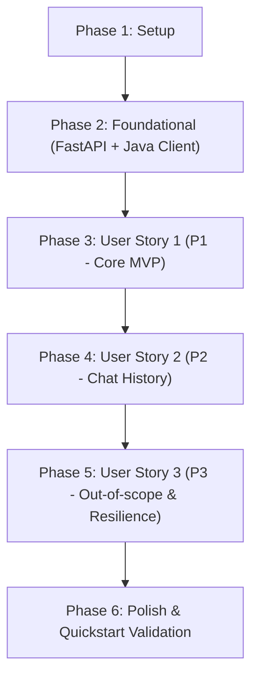

# Tasks: RAG Chatbot UI

**Feature**: 003-rag-chatbot-ui | **Date**: 2026-09-03 | **Spec**: [spec.md](./spec.md) | **Plan**: [plan.md](./plan.md)

## Phase 1: Setup (Shared Infrastructure & Dependencies)

**Purpose**: Thiết lập các phụ thuộc và cấu trúc thư mục cho cả 3 tầng (Python, Java, Frontend)

- [X] T001 Cài đặt thư viện Python bổ sung `fastapi` và `uvicorn` trong môi trường Python
- [X] T002 [P] Tạo cấu trúc thư mục frontend cho chatbot tại `frontend/src/components/chatbot/` và `frontend/src/pages/`
- [X] T003 [P] Tạo cấu trúc package Java cho chatbot tại `src/main/java/org/example/chat/application/chatbot/` và `src/main/java/org/example/chat/infrastructure/rag/`


---

## Phase 2: Foundational (Blocking Prerequisites)

**Purpose**: Xây dựng hạ tầng kết nối cốt lõi — Python FastAPI Microservice và Java HTTP Client. Bắt buộc hoàn thành trước khi triển khai các User Story UI.

**⚠️ CRITICAL**: Không User Story nào có thể hoạt động hoàn chỉnh nếu thiếu tầng dịch vụ kết nối này.

- [X] T004 Xây dựng Python FastAPI microservice tại `rag_data/rag_api.py` nạp ChromaDB qua lifespan và cung cấp endpoint `GET /health`
- [X] T005 [P] Định nghĩa Java DTOs cho chatbot gồm `ChatbotRequest.java`, `ChatbotResponse.java` và `SourceDto.java` tại `src/main/java/org/example/chat/presentation/dto/`
- [X] T006 Triển khai Java HTTP client gọi Python service tại `src/main/java/org/example/chat/infrastructure/rag/RagApiClient.java`
- [X] T007 [P] Cấu hình CORS và RestTemplate bean trong Spring Boot tại `src/main/java/org/example/chat/infrastructure/config/ChatbotConfig.java`


**Checkpoint**: Nền tảng Backend và Python Microservice đã sẵn sàng kết nối.

---

## Phase 3: User Story 1 - Gửi câu hỏi và nhận câu trả lời từ chatbot (Priority: P1) 🎯 MVP

**Goal**: Người dùng có thể nhập câu hỏi tại giao diện `/chatbot`, câu hỏi đi qua Java backend đến Python RAG, và câu trả lời kèm nguồn FAQ được hiển thị trên màn hình trong ≤ 10 giây.

**Independent Test**: Khởi động FastAPI và Java backend, mở trang `/chatbot`, nhập `"Làm sao để tìm bạn bè?"` và xác nhận nhận được câu trả lời từ bot có kèm thẻ nguồn FAQ.

### Tests cho User Story 1
- [X] T008 [P] [US1] Viết unit test cho endpoint FastAPI `POST /ask` tại `rag_data/tests/test_rag_api.py`
- [X] T009 [P] [US1] Viết controller test cho endpoint Java `POST /api/chatbot/ask` tại `src/test/java/org/example/chat/presentation/controller/ChatbotControllerTest.java`

### Implementation cho User Story 1
- [X] T010 [US1] Triển khai endpoint `POST /ask` trong `rag_data/rag_api.py` gọi hàm `rag_online.answer()`
- [X] T011 [US1] Triển khai `ChatbotService.java` tại `src/main/java/org/example/chat/application/chatbot/ChatbotService.java`
- [X] T012 [US1] Triển khai `ChatbotController.java` tại `src/main/java/org/example/chat/presentation/controller/ChatbotController.java` xử lý `POST /api/chatbot/ask`
- [X] T013 [P] [US1] Xây dựng API service frontend tại `frontend/src/services/chatbotService.ts` gọi `POST /api/chatbot/ask`
- [X] T014 [P] [US1] Xây dựng component hiển thị nguồn FAQ `SourceBadge.tsx` tại `frontend/src/components/chatbot/SourceBadge.tsx`
- [X] T015 [P] [US1] Xây dựng component bong bóng chat `MessageBubble.tsx` tại `frontend/src/components/chatbot/MessageBubble.tsx`
- [X] T016 [US1] Xây dựng component ô nhập liệu và nút Gửi `ChatInput.tsx` tại `frontend/src/components/chatbot/ChatInput.tsx`
- [X] T017 [US1] Xây dựng custom hook `useChatbot.ts` quản lý gửi câu hỏi và trạng thái loading tại `frontend/src/hooks/useChatbot.ts`
- [X] T018 [US1] Xây dựng trang chính `ChatbotPage.tsx` tại `frontend/src/pages/ChatbotPage.tsx` kết nối hook và components
- [X] T019 [US1] Tích hợp route `/chatbot` và nút điều hướng vào ứng dụng tại `frontend/src/App.tsx`

**Checkpoint**: User Story 1 hoàn tất — MVP có thể hỏi đáp với bot và thấy câu trả lời cùng nguồn FAQ.

---

## Phase 4: User Story 2 - Lịch sử hội thoại trong phiên làm việc (Priority: P2)

**Goal**: Người dùng xem lại được toàn bộ các lượt hỏi đáp trong phiên hiện tại, giao diện tự động cuộn xuống tin nhắn mới nhất, và có thể xóa lịch sử để bắt đầu lại.

**Independent Test**: Gửi 3 câu hỏi liên tiếp, kiểm tra toàn bộ 6 tin nhắn hiển thị đúng thứ tự, trang tự cuộn xuống dưới cùng; nhấn nút Xóa/Clear và kiểm tra màn hình được làm sạch.

### Implementation cho User Story 2
- [X] T020 [US2] Xây dựng component khung chat hoàn chỉnh `ChatWindow.tsx` tích hợp auto-scroll khi có tin nhắn mới tại `frontend/src/components/chatbot/ChatWindow.tsx`
- [X] T021 [US2] Bổ sung chức năng `clearChat` và lưu trữ danh sách tin nhắn trong `frontend/src/hooks/useChatbot.ts`
- [X] T022 [US2] Bổ sung nút "Xóa hội thoại" (Clear Chat) với icon và modal xác nhận tại `frontend/src/components/chatbot/ChatWindow.tsx`
- [X] T023 [P] [US2] Viết unit test cho component `ChatWindow.tsx` kiểm tra render danh sách tin nhắn và auto-scroll tại `frontend/src/components/chatbot/ChatWindow.test.tsx`

**Checkpoint**: User Story 2 hoàn tất — Trải nghiệm hội thoại liên tục, mượt mà và quản lý session tốt.

---

## Phase 5: User Story 3 - Xử lý câu hỏi ngoài phạm vi & Lỗi kết nối (Priority: P3)

**Goal**: Khi câu hỏi ngoài phạm vi FAQ hoặc khi backend mất kết nối, hệ thống hiển thị thông báo từ chối thân thiện, không bịa đặt thông tin và có chỉ dẫn rõ ràng.

**Independent Test**: Nhập `"Thời tiết hôm nay thế nào?"`, xác nhận bot từ chối lịch sự và không hiện nguồn FAQ nào; tắt Python service và gửi câu hỏi, xác nhận hiển thị banner lỗi kết nối thân thiện.

### Implementation cho User Story 3
- [X] T024 [US3] Xử lý ngoại lệ kết nối `RagApiException` trong Java backend tại `src/main/java/org/example/chat/presentation/exception/GlobalExceptionHandler.java` trả về status 503
- [X] T025 [US3] Xử lý cờ `hasContext == false` trong `frontend/src/components/chatbot/MessageBubble.tsx` để ẩn phần nguồn FAQ và hiển thị styling gợi ý
- [X] T026 [US3] Bổ sung trạng thái lỗi kết nối và nút "Thử lại" (Retry) vào `frontend/src/components/chatbot/ChatWindow.tsx`
- [X] T027 [P] [US3] Bổ sung các câu hỏi gợi ý nhanh (Quick Prompts) về ứng dụng ChatMessage khi chat rỗng tại `frontend/src/components/chatbot/ChatWindow.tsx`

**Checkpoint**: Cả 3 User Stories đều hoạt động độc lập và vững chắc trước lỗi.

---

## Phase 6: Polish & Cross-Cutting Concerns

**Purpose**: Tối ưu giao diện, responsive cho mobile, kiểm tra bảo mật và xác minh toàn bộ kịch bản nghiệm thu.

- [X] T028 [P] Tối ưu hóa CSS responsive cho mobile (độ rộng 320px - 768px) với Tailwind tại `frontend/src/components/chatbot/ChatWindow.tsx`
- [X] T029 Kiểm tra không lộ `GOOGLE_API_KEY` ra frontend hay client response và xác minh biến môi trường an toàn tại `rag_data/.env`
- [X] T030 Thực hiện nghiệm thu toàn bộ 6 kịch bản theo tài liệu `specs/003-rag-chatbot-ui/quickstart.md`


---

## Dependencies & Execution Order

### Phase Dependencies



- **Setup (Phase 1)**: Có thể bắt đầu ngay lập tức.
- **Foundational (Phase 2)**: Phụ thuộc vào Phase 1; BLOCKS toàn bộ User Stories vì cần API contract và client.
- **User Story 1 (Phase 3)**: Phụ thuộc vào Phase 2 — Đây là MVP có thể demo được.
- **User Story 2 (Phase 4)**: Phụ thuộc vào User Story 1 (mở rộng trên Message list và hook state).
- **User Story 3 (Phase 5)**: Phụ thuộc vào User Story 1 & 2 (xử lý edge cases, empty state, error banners).
- **Polish (Phase 6)**: Phụ thuộc vào tất cả stories đã hoàn thành.

### Parallel Opportunities

- **Trong Phase 1**: T002 (Frontend dir) và T003 (Java packages) có thể chạy song song.
- **Trong Phase 2**: T005 (Java DTOs) và T007 (CORS config) có thể chạy song song với T004 (FastAPI service).
- **Trong Phase 3**:
  - T008 (Test Python) và T009 (Test Java) có thể viết song song.
  - T013 (Frontend service), T014 (SourceBadge), T015 (MessageBubble) có thể code song song trước khi ráp vào ChatInput/ChatWindow.
- **Trong Phase 4 & 5**: T023 (Test frontend) và T027 (Quick prompts) có thể chạy song song.

---

## Parallel Example: User Story 1 Frontend Components

```bash
# Xây dựng các component UI độc lập cùng lúc:
Task: "Xây dựng component hiển thị nguồn FAQ SourceBadge.tsx tại frontend/src/components/chatbot/SourceBadge.tsx"
Task: "Xây dựng component bong bóng chat MessageBubble.tsx tại frontend/src/components/chatbot/MessageBubble.tsx"
Task: "Xây dựng API service frontend tại frontend/src/services/chatbotService.ts"
```

---

## Implementation Strategy

### MVP First (User Story 1 Only)
1. Hoàn thành **Phase 1: Setup** (T001 - T003)
2. Hoàn thành **Phase 2: Foundational** (T004 - T007)
3. Hoàn thành **Phase 3: User Story 1** (T008 - T019)
4. **STOP và VALIDATE**: Kiểm tra gửi câu hỏi và nhận câu trả lời kèm FAQ nguồn tại `http://localhost:5173/chatbot`.
5. Đã có thể demo tính năng RAG Chatbot cho người dùng!

### Incremental Delivery
- Sau khi MVP chạy tốt, chuyển sang **Phase 4** để nâng cấp trải nghiệm cuộn tự động và xóa chat.
- Tiếp tục **Phase 5** để hoàn thiện xử lý lỗi và câu hỏi ngoài phạm vi.
- Cuối cùng là **Phase 6** để tối ưu hóa responsive và test toàn diện theo `quickstart.md`.
